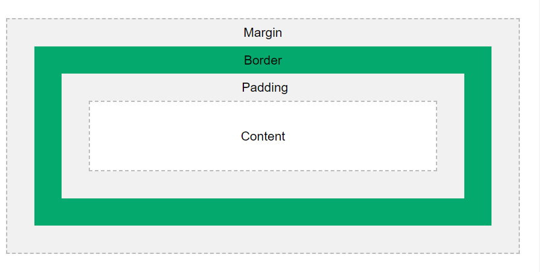

<!-- START doctoc generated TOC please keep comment here to allow auto update -->
<!-- DON'T EDIT THIS SECTION, INSTEAD RE-RUN doctoc TO UPDATE -->
**Table of Contents**  *generated with [DocToc](https://github.com/thlorenz/doctoc)*

- [The Css Box Model](#the-css-box-model)
  - [code block using CSS](#code-block-using-css)
  - [Example using CSS](#example-using-css)
  - [Example HTML and CSS:](#example-html-and-css)
  - [more information](#more-information)
  - [Enjoy the nature](#enjoy-the-nature)
  - [Thank you .](#thank-you-)

<!-- END doctoc generated TOC please keep comment here to allow auto update -->

# The Css Box Model

The CSS box model describes the space that surrounds each HTML element. It consists of the following:

- **Content**: The actual content of the box, where text and images appear.
- **Padding**: Clears an area around the content. The padding is transparent.
- **Border**: A border that goes around the padding and content.
- **Margin**: Clears an area outside the border. The margin is transparent.



## code block using CSS
css syntax for the box model.the syntax is as shown below.
## Example using CSS
```css
div{
    padding:30px;
    margin:20px;
    border:3px solid red;

}

```
## Example HTML and CSS:


<!DOCTYPE html>
<html>
<head>
    <title>CSS Box Model Example</title>
    <style>
        .container {
            width: 200px;
            height: 100px;
            padding: 20px;
            border: 5px solid black;
            margin: 10px;
        }
    </style>
</head>
<body>
    <div class="container">
        This is a box using CSS Box Model.
    </div>
</body>
</html>

## more information
for more information on the CSS box model, please visit [click here](index.html).


## Enjoy the nature
[enjoy the nature](./assets/nature.jpg)


## Thank you .